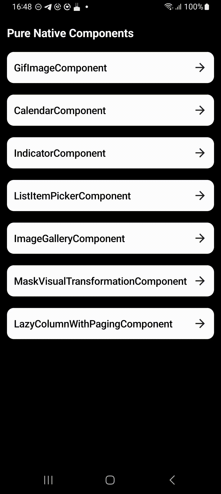
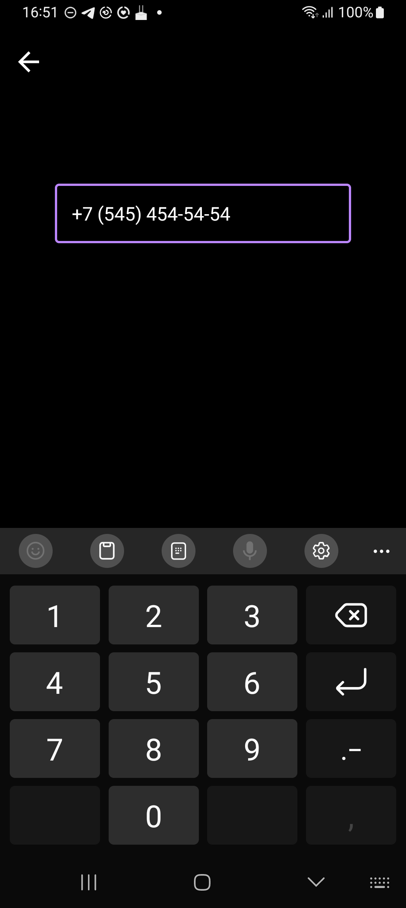
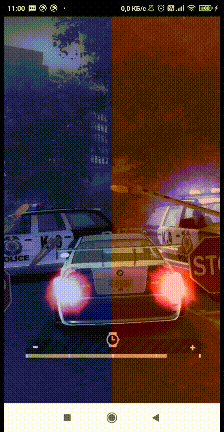
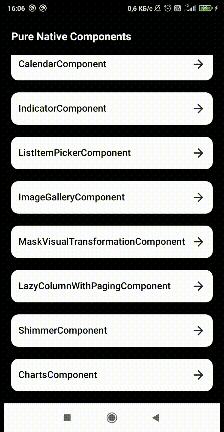

## Pure Native Components
Pure Native Components is an library that includes some components written in Jetpack Compose.
The bottom line is that these components were often encountered in our projects and it was decided to move them to a separate library 
for the convenience of current and future employees of the company and just people who it would be interesting to look at the functions created by Jetpack Compose.
Also, libraries of other open access users whose functionality we need have been and will be transferred here.

<strong>Modules</strong>
### [Core](./core/)
Common Android things.
### [Compose](./compose/)
Jetpack Compose things.
### [Sample](./sample/)
Sample App for research and development.

## Installation

### Gradle

Make sure you've added Kotlin support to your project.

```gradle
repositories {
    maven { url 'https://jitpack.io' }
}

dependencies {
    implementation 'com.github.purenative.pn-android:core:$latest_version'
    implementation 'com.github.purenative.pn-android:compose:$latest_version'
}
```

## Appearance, examples and description
At the moment the sample app looks like this:


<strong>Examples</strong>
### [GifImageComponent](./sample/src/main/java/pn/android/gif_image_example/GifImageScreen.kt)


The component is responsible for displaying your GIF
### [CalendarComponent](./sample/src/main/java/pn/android/calendar_example/CalendarScreen.kt)


The component is designed to display a calendar. From the functionality, it is possible to determine the difference in days between two selected dates and clear the result
### [PrimaryIndicatorComponent](./sample/src/main/java/pn/android/primary_indicator_example/PrimaryIndicatorScreen.kt)


The component is designed to display the loading status on the screen
### [ListItemPickerComponent](./sample/src/main/java/pn/android/list_item_picker_example/ListItemPickerScreen.kt)


The component is designed to be able to select from a list of elements of a certain type
### [ImageGalleryComponent](./sample/src/main/java/pn/android/image_gallery_example/ImageGalleryScreen.kt)


The component is designed to display a gallery of images with the ability to zoom in using a double click or by simultaneously spreading two fingers on the screen
### [MaskVisualTransformationComponent](./sample/src/main/java/pn/android/mask_visual_transformation_example/MaskVisualTransformationScreen.kt)


The component is designed to control the input format
### [LazyColumnWithPagingComponent](./sample/src/main/java/pn/android/lazy_column_with_paging/LazyColumnWithPagingScreen.kt)


The component is designed to display a list with a large amount of data. 
To spend much less resources on getting a large amount of data at once,
the component suggests dividing this data into smaller pieces and requesting further data when approaching the end of the list
### [ShimmerComponent](sample/src/main/java/pn/android/shimmer_example/ShimmerScreen.kt)
<details>
    <summary>An example of how the component works</summary>
    
</details>


Component of a real screen, where during the loading of data, 
flickering blocks of the sizes corresponding to these components are displayed in place of the final UI.
### [ChartComponent](sample/src/main/java/pn/android/charts_example/ChartsScreen.kt)
<details>
    <summary>An example of how the component works</summary>
    
</details>


The component is designed to display tables